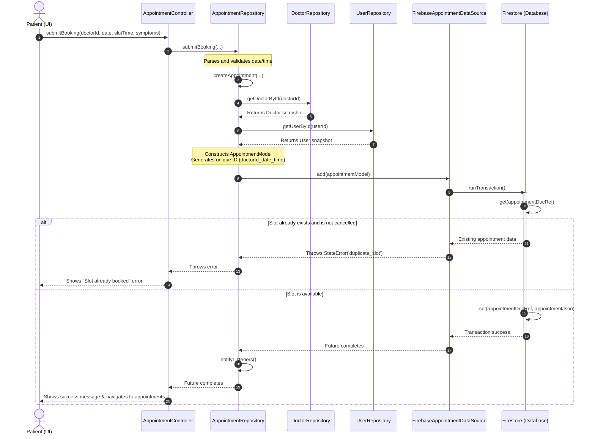

# Appointment Booking Flow - Sequence Diagram

This sequence diagram illustrates the end-to-end data flow when a patient books a new appointment in the PulseCare app.

```mermaid
sequenceDiagram
    autonumber
    actor Patient as Patient (UI)
    participant Controller as AppointmentController
    participant Repo as AppointmentRepository
    participant DocRepo as DoctorRepository
    participant UserRepo as UserRepository
    participant DS as FirebaseAppointmentDataSource
    participant DB as Firestore (Database)

    Patient->>Controller: submitBooking(doctorId, date, slotTime, symptoms)
    Controller->>Repo: submitBooking(...)
    
    Note over Repo: Parses and validates date/time
    
    Repo->>Repo: createAppointment(...)
    
    Repo->>DocRepo: getDoctorById(doctorId)
    DocRepo-->>Repo: Returns Doctor snapshot
    
    Repo->>UserRepo: getUserById(userId)
    UserRepo-->>Repo: Returns User snapshot
    
    Note over Repo: Constructs AppointmentModel<br/>Generates unique ID (doctorId_date_time)

    Repo->>DS: add(appointmentModel)
    
    DS->>DB: runTransaction()
    activate DB
    DB->>DB: get(appointmentDocRef)
    
    alt Slot already exists and is not cancelled
        DB-->>DS: Existing appointment data
        DS-->>Repo: Throws StateError('duplicate_slot')
        Repo-->>Controller: Throws error
        Controller-->>Patient: Shows "Slot already booked" error
    else Slot is available
        DB->>DB: set(appointmentDocRef, appointmentJson)
        DB-->>DS: Transaction success
        deactivate DB
        DS-->>Repo: Future completes
        
        Repo->>Repo: notifyListeners()
        Repo-->>Controller: Future completes
        Controller-->>Patient: Shows success message & navigates to appointments
    end
```